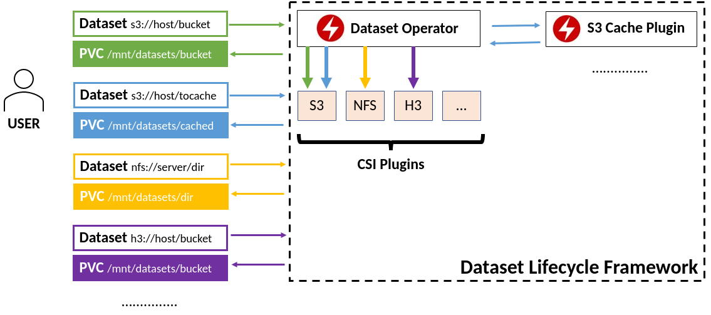

[](https://goreportcard.com/report/github.com/datashim-io/datashim)
[](https://bestpractices.coreinfrastructure.org/projects/4821)
# Datashim

> [!NOTE]  
> **_Help us shape the future of Datashim - fill in our short anonymous user survey [here](https://forms.gle/wMSkDGfeGzw5XyCM7)_** 


>Our Framework introduces the **Dataset** CRD which is a pointer to existing S3 and NFS data sources. It includes the
>necessary logic to map these Datasets into Persistent Volume Claims and ConfigMaps which users can reference in their
>pods, letting them focus on the workload development and not on configuring/mounting/tuning the data access. Thanks to
>[Container Storage Interface](https://kubernetes-csi.github.io/docs/) it is extensible to support additional data sources in the future.



A Kubernetes Framework to provide easy access to S3 and NFS **Datasets** within pods. Orchestrates the provisioning of
**Persistent Volume Claims** and **ConfigMaps** needed for each **Dataset**. Find more details in our [FAQ](https://datashim-io.github.io/datashim/FAQ/)

> [!WARNING]
> 🚨 (23 Jan 2024) - Group Name Change
> 
> __If you have an existing installation of Datashim, please DO NOT follow the instructions below to upgrade it to version `0.4.0` or latest__. The group name of the Dataset and DatasetInternal CRDs (objects) is changing from `com.ie.ibm.hpsys` to `datashim.io`. An upgrade in place will invalidate your Dataset definitions and will cause problems in your installation. You can upgrade up to version `0.3.2` without any problems. 
>
>To upgrade to `0.4.0` and beyond, please a) delete all datasets safely; b) uninstall Datashim; and c) reinstall Datashim either through Helm or using the manifest file as follows.

## Quickstart

First, create the namespace for installing Datashim, if not present

```bash
kubectl create ns dlf
```

In order to quickly deploy Datashim, based on your environment execute **one** of the following commands:

- **Kubernetes/Minikube/kind**
```bash
kubectl apply -f https://raw.githubusercontent.com/datashim-io/datashim/master/release-tools/manifests/dlf.yaml
```
- **Kubernetes on IBM Cloud**
```bash
kubectl apply -f https://raw.githubusercontent.com/datashim-io/datashim/master/release-tools/manifests/dlf-ibm-k8s.yaml
```
- **Openshift**
```bash
kubectl apply -f https://raw.githubusercontent.com/datashim-io/datashim/master/release-tools/manifests/dlf-oc.yaml
```
- **Openshift on IBM Cloud**
```bash
kubectl apply -f https://raw.githubusercontent.com/datashim-io/datashim/master/release-tools/manifests/dlf-ibm-oc.yaml
```

Wait for all the pods to be ready :)
```bash
kubectl wait --for=condition=ready pods -l app.kubernetes.io/name=datashim -n dlf
```

As an **optional** step, label the namespace(or namespaces) you want in order have the pods labelling functionality (see below for an example with default namespace).
```bash
kubectl label namespace default monitor-pods-datasets=enabled
```

> [!TIP]
> In case don't have an existing S3 Bucket follow our wiki to [deploy an Object Store](https://github.com/datashim-io/datashim/wiki/Deployment-and-Usage-of-S3-Object-Stores)
and populate it with data.

We will create now a Dataset named `example-dataset` pointing to your S3 bucket.
```yaml
cat <<EOF | kubectl apply -f -
apiVersion: datashim.io/v1alpha1
kind: Dataset
metadata:
  name: example-dataset
spec:
  local:
    type: "COS"
    accessKeyID: "{AWS_ACCESS_KEY_ID}"
    secretAccessKey: "{AWS_SECRET_ACCESS_KEY}"
    endpoint: "{S3_SERVICE_URL}"
    bucket: "{BUCKET_NAME}"
    readonly: "true" #OPTIONAL, default is false  
    region: "" #OPTIONAL
EOF
```

If everything worked okay, you should see a PVC and a ConfigMap named `example-dataset` which you can mount in your pods.
As an easier way to use the Dataset in your pod, you can instead label the pod as follows:
```yaml
apiVersion: v1
kind: Pod
metadata:
  name: nginx
  labels:
    dataset.0.id: "example-dataset"
    dataset.0.useas: "mount"
spec:
  containers:
    - name: nginx
      image: nginx
```

As a convention the Dataset will be mounted in `/mnt/datasets/example-dataset`. If instead you wish to pass the connection
details as environment variables, change the `useas` line to `dataset.0.useas: "configmap"`

Feel free to explore our [other examples](./examples)

> [!IMPORTANT]
> We recommend using secrets to pass your S3/Object Storage Service credentials to Datashim, as shown in [this example](./examples/templates/example-dataset-s3-provision.yaml).

> [!NOTE]
> Datashim uses a Mutating Webhook which uses a self-signed certificate. We recommend the use of `cert-manager` to manage this certificate. Please take a look at [this note](docs/cert-manager.md) for instructions to do this. 

## Helm Installation

Hosted Helm charts have been made available for installing Datashim. This is how you can do a Helm install:

```bash
helm repo add datashim https://datashim-io.github.io/datashim/
```
```bash
helm repo update
```
This should produce an output of `...Successfully got an update from the "datashim" chart repository` in addition to the other Helm repositories you may have.

To install, search for the latest stable release

```bash
helm search repo datashim --versions
```
which will result in:
```
NAME                    	CHART VERSION	APP VERSION	DESCRIPTION
datashim/datashim-charts	0.4.0        	0.4.0      	Datashim chart
datashim/datashim-charts	0.3.2        	0.3.2      	Datashim chart
```

> [!CAUTION]
> Version `0.3.2` still has `com.ie.ibm.hpsys` as the apiGroup name. So, please proceed with caution. It is fine for upgrading from an existing Datashim installation but going forward the apiGroup will be `datashim.io` 


Pass the option to create namespace, if you are installing Datashim for the first time:
```bash
helm install --namespace=dlf --create-namespace datashim datashim/datashim-charts --version <version_string>
```
Do not forget to label the target namespace to support pod labels, as shown in the previous section

### Uninstalling through Helm

To uninstall, use `helm uninstall` like so:
```bash
helm uninstall -n dlf datashim
```

### Installing intermediate releases

You can query the Helm repo for intermediate releases (`.alpha`, `.beta`, etc). To do this, you need to pass `--devel` flag to Helm repo search, like so:

```bash
helm search repo datashim --devel
```

To install an intermediate version, 
```bash
helm install --namespace=dlf --create-namespace datashim datashim/datashim-charts --devel --version <version_name>
```

## Questions

The wiki and [Frequently Asked Questions](https://datashim-io.github.io/datashim/FAQ) documents are a bit out of date. We recommend browsing [the issues](https://github.com/datashim-io/datashim/issues?q=is%3Aissue+label%3Aquestion) for previously answered questions. Please open an issue if you are not able to find the answers to your questions, or if you have discovered a bug. 

## Contributing

We welcome all contributions to Datashim. Please read [this document](./docs/GitWorkflow.md) for setting up a Git workflow for contributing to Datashim. This project uses [DCO (Developer Certificate of Origin)](https://github.com/apps/dco) to certify code ownership and contribution rights. 

If you use VSCode, then we have [recommendations for setting it up for development](./docs/GolangVSCodeGit.md). 

If you have an idea for a feature request, please open an issue. Let us know in the issue description the problem or the pain point, and how the proposed feature would help solve it. If you are looking to contribute but you don't know where to start, we recommend looking at the open issues first. Thanks!

